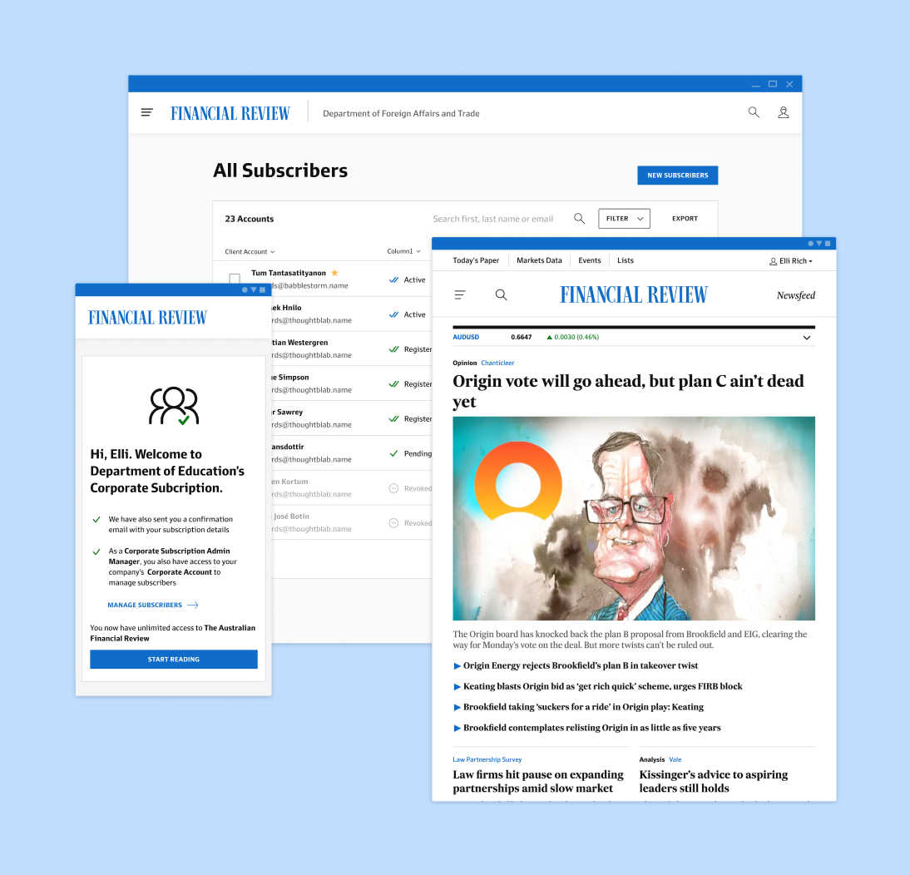
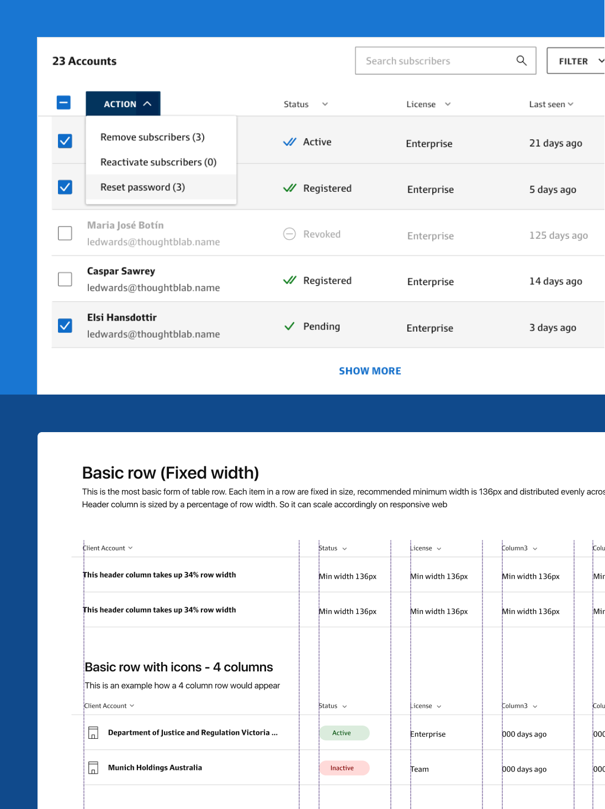
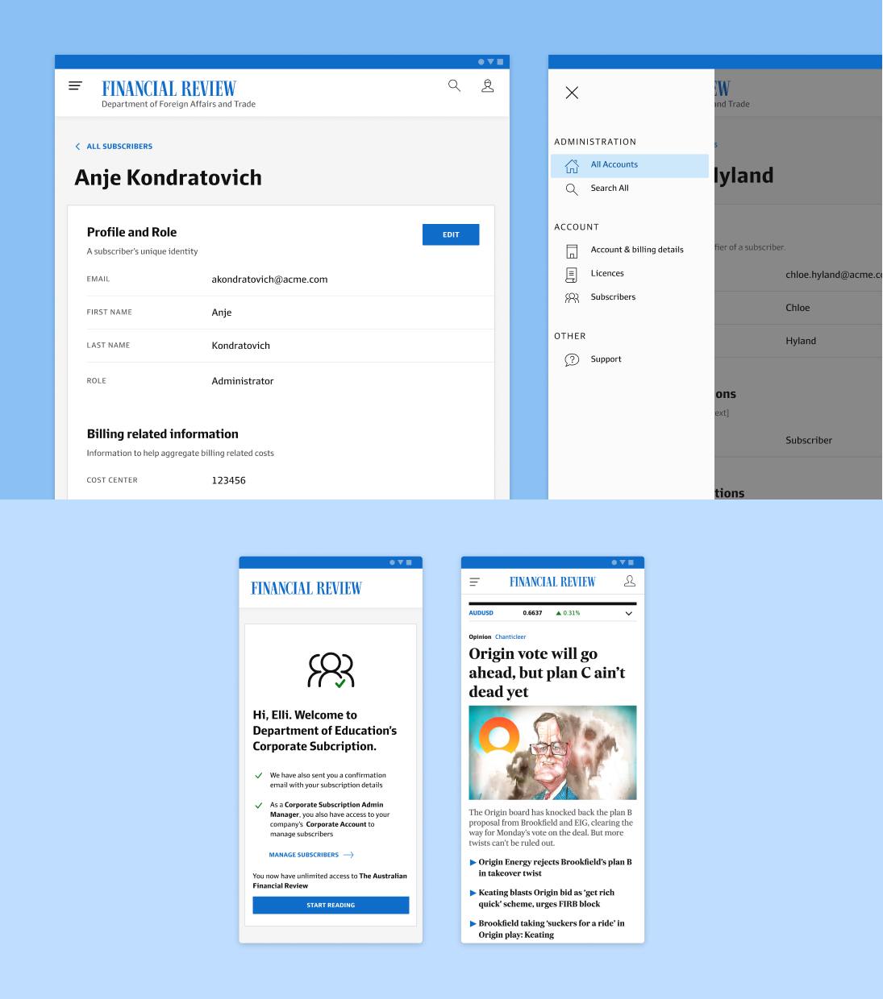
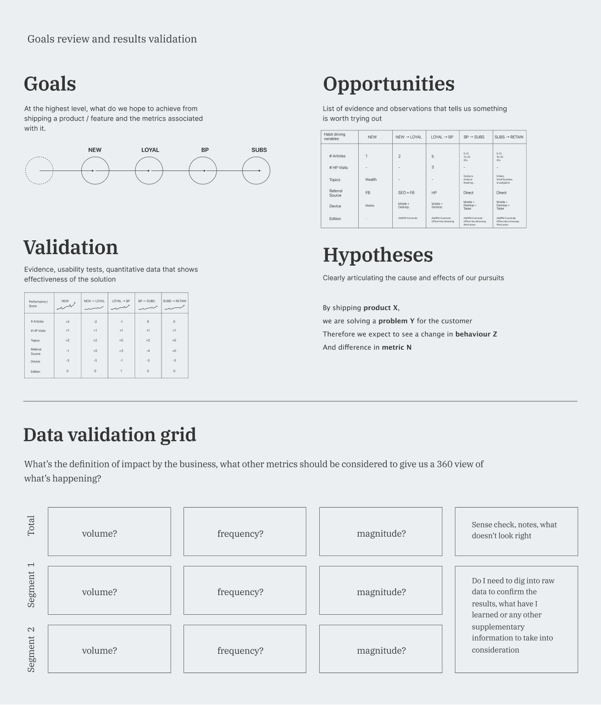

{/* --- */}

## Current State of the Business

Acknowledging that things are messy, ambiguous or even hidden at this point. This step really is about engagement and learning, getting the right people in the room and talk about what they do, and let things unfold usually. This seemingly casual step can usually mean whether we go ahead with something or not. A few key things i’ve noticed made me think whether we would even be doing this in the first place had we not done it ‘right’? Here some of them are obvious and some of require more planning even though not obvious are:

1. Making sure the right people, or people needed are present in the room at the same time - so that we can shorten the feedback loop if it needs to be quickly confirmed or discussed at any point rather than having to schedule another meeting
2. Getting the right person to facilitate - this can be a challenge as this can be a dedicated skillset or getting the right person with the right influence. We were lucky to have a strong facilitator in our team who took care of these workshops.
3. Be honest whether the right information has been collected or not - this can be uncomfortable to some when there are tight deadlines are delivery commitments. However at the end of the day, business processes are complex and people’s thoughts may not be linear all the time, but making sure people are aware we are here to gather critical information is important, and having a shared understanding that there is are consequences in making the wrong assumptions and why not have a conversation if that’s all it takes?

---

## Challenges and Hurdles

After a few rounds of workshops and strategy sprints, patterns began to emerge it became more obvious what were the business issues in hand. For example, client information was passed through different systems by hand, and people relied on manual processes to constantly lookup and update information. Not to mention each of those systems were built a long time ago and no longer fit for purpose. Together, it created a yarn of problems to solve and our jobs were to figure out how to pinpoint each problem and prioritise which ones we could tackle first.

1. Is this about leakage of information because of the manual workflows instead of it being automated?
2. Is this about addressing the human bottlenecks due to lack of resources to attend to volume of manual workflows?
3. Is it simply about fixing a few platform bugs or does it need re platforming to replace legacy technology. If so, is it something we can do in background without disrupting the current workflow unnecessarily?

And in any of those cases, does developing a product actually solve those problems more effectively than not building a platform?

---

## Opportunities analysis

This is an interesting more often than not boils down to 2 things – Business impact, and technical feasibility, and how to best find the middle ground when both are deeply interdependent of each other.

As one of the main cross functional partners, my role was to use visual artefacts to show what those options might look like, and highlight the risks, and impacts as we are assessing options. However, given the state we are in, the business decided it was more important to the groundwork in order to scale later, rather than taking the high impact approach.

I worked with engineers and technical stakeholders to draw out architectural workflows and created rapid prototypes to help teams visualise how a better user journey might look like.

---

## Discovery and prototyping

These are by no means final solutions to be built. Rather, they were put together at the initial stage as realistic stimulus to help the working group imagine a better way of working and point out gaps that might have been overlooked during discovery.

---

## Co-designed approach

I’ve found another way to effectively communicate design ideas to stakeholders without being bogged down with design details too early, apart from using abstract wireframes are by writing down the intent of each screen. Ideation of different UI’s are just another way to present that screen to the user and not everyone is great at giving feedback on abstract visual. This worked well for those who can give better feedback on written communication, or a mixture of both.

The goal here, is to get business, product and engineering understanding substantially how things work both to validate business intent and technical feasibility, making it easier for cross functional teams to direct their input towards the right places.

---

## Interface design

### Design principles

This was about setting up interaction models and information architecture and app structure that best fits the mental models and user journeys when using the app. Taking into account how we systematically hide and show navigation items based on users’ access levels. Taking into account future state and how easily can we accommodate more sections and cater for more complex journeys. And how will I be able to easily evolve these patterns to cater for future additions?

### Tone and voice

This comes down to underlying visual design, as well as voice and tone presented. We adopted some bold and clean icons to messaging pages to give it touch of personality but followed the same language and voice and tone guidelines that were used across other news platforms.
I wanted to make sure our platform had a clear voice and give guidance to the user, the key is balancing what the user would know intuitively, versus what is required to communicate to guide them down the right path without overpowering the task at hand.

### Design system

‍A large part of the work here is about maintaining consistency in behaviour as most of the people using this app will be interacting across different platforms as well therefore should assume the same behaviours when using our app. This also helps us avoid repeating the same work that other teams have already done when vetting the right interaction design patterns for specific purposes. Having a clear process and understanding what are the existing components from our global library that allows me to assemble pages that I need quickly vs do i need to evolve and define new ones because of a unique use case

---

## Core experiences

I lead the overall design execution phase from defining application interaction models, information architecture, visual design, design system consumption and creation, interaction design ideation and prototyping to peer reviewing front end development to make sure usability and fit and finish polish.

### Bulk actions

### Frictionless onboarding

### Search

---

## Measuring success

When it came to launching, I personally keep a log of ‘design bugs’ that I thought could be easily fixed that could solve some usability issues.

In terms of the bigger ticket goals, like how well does this really help administrators better manage clients and their subscribers, I personally keep a diff of workflows that the release is solving, and make sure to observe that that is the case when I get a chance to sit with administrators and see them use it.

These were also some thinking and frameworks that I put together when we have a bigger launch in the future. Honing my analytics skills from other roles, I put together a framework that could help us validate the product in a more robust a thorough manner.
