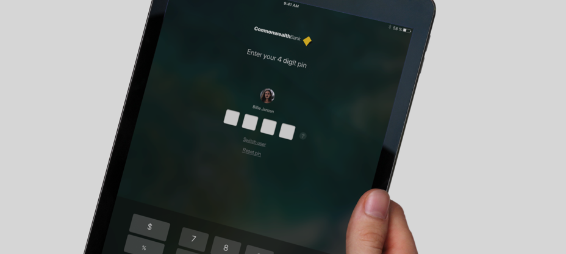

"Branch staff often share a single smartphone device within a given branch, to login each time using full staff password is time consuming. If each staff member could register a unique temporary pin with the device, it would allow quick authentication when switching between users."

---

{/* TODO: Add video */}
