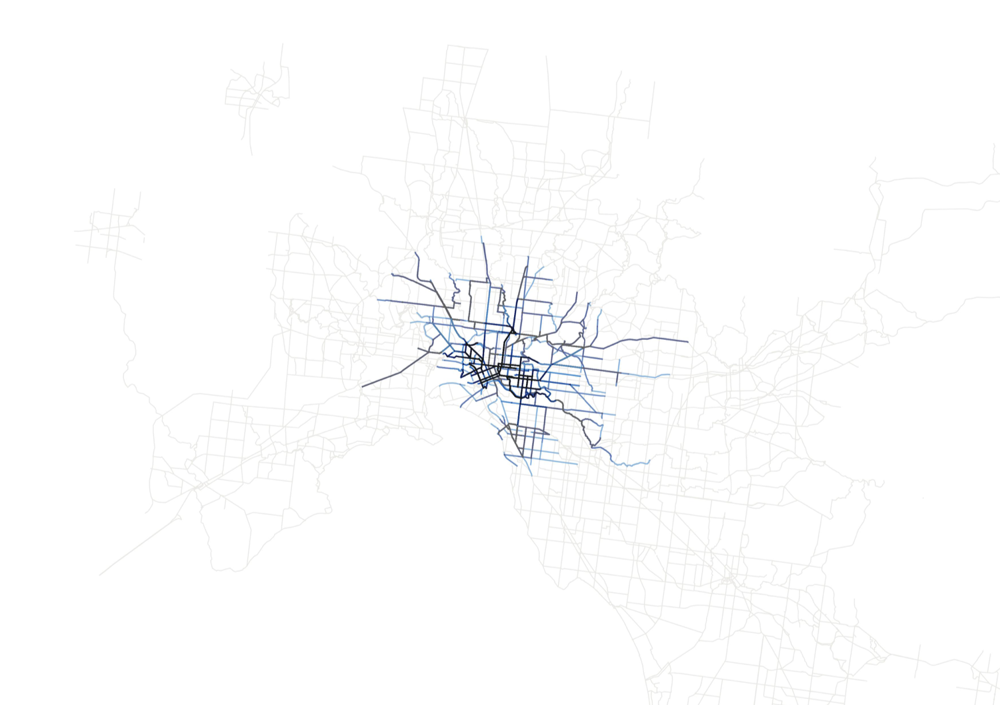

How much are you willing to pay to cycle to work? Given that the bike and the helmet is free. This is not a trick question. As we live in a world with limited resources, everything we do and not do, has a cost. Therefore decision making boils down to how much you are willing to pay.

This is my winning entry to the Geonext Hackathon held in November 2016

---

## Technical background

{/* TODO: Update video */}
{/*  */}

The internal perception of surroundings by a person with limited or no sight is remarkably different to our own. How do we design an interface which delivers information to this particular group of users in the most accessible and meaningful way?
