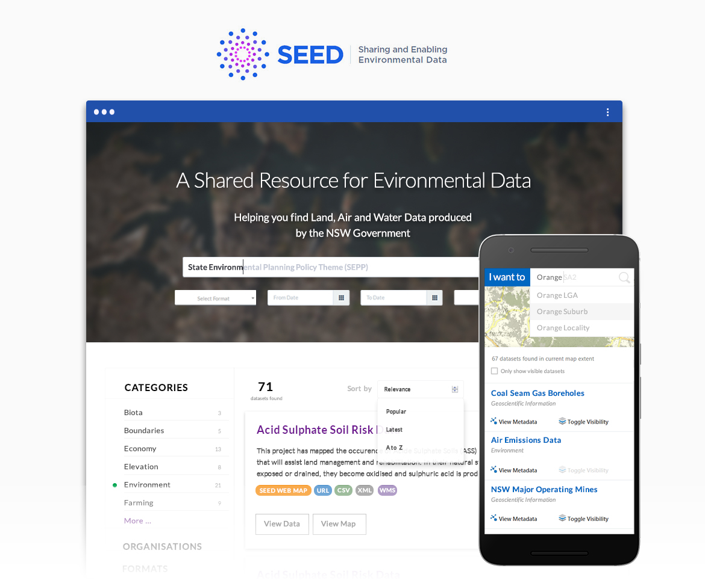

SEED (Sharing and Enabling Environmental Data) is a plaform built for storing, sharing and visualising environmental information. It empowers the community to search for and analyse large amounts of data when making critical decisions about the environment.

---

## Spatial query technical background

Most people would have familar with the concept of searching for a nearby location. (eg. Using Google Maps to search for nearby amenities, points of interest, or using Uber to find the nearest ride etc.) This also means, finding nearest x,y coordinates in relation to the user’s x,y coordnate.

### Geospatial features in real life

When it comes to more complex geospatial features, finding the nearest patch of land may not be as simple finding x,y coordinates only. There are several considerations such as the centroid and geometry of the layer or layer itersection rules that may skew query results.

### Technical challenges

There are various out of the box solutions that enable spatial search by map extent (left figure) and in principle, fulfills the criteria of spatial search in the brief. However, this requires the spatial layers to be visible on the map. With more than 200 geospatial layers in our repository, this feature becomes very cumbersome to use, let alone helping people make sense of the data they are seeing. It impacts overall usability due to:

1. Visual information overload
2. Incomplete representation of spatial information (documents such as legislative information are not physically present on the map but still pertinent to the search critieria)
3. Poor loading performance on the browser

---

## Building a lighter weight search

While spatial information are highly visual, but in reality we know search can be fast and optimal if it does not need require data to be rendered graphically. Here’s an example solution to match spatial extent to spatial layers without having to render them extensively on the browser.

### Behind the scenes

1. Divide New South Wales into 200+ base sections based on Local Government Area (LGA). Other options: this can be done using uniform grids or finer grain boundaries such as SA2 or Suburbs.

 2. Iterate through all layers in the database. For each LGA that the layer intersects with, assign that intersecting LGA as an attribute. Return json that shows each spatial layer and their corresponding LGA attributes.

 3. When user performs a search by spatial extent, the system only needs to know which LGA intersects with the search extent. Return a list of those LGAs.

 4. Using the returned list in step 3, iterate through the json in step 2 and find spatial layers that have matching LGAs with that list.

### Results preview and visual confirmation

The returned list could still be extensive. Here, we introduced a preview functionality to help users visually confirm the results before proceeding to load the spatial layer. This reduces the amount of time they have to wait while the browser is rendering layer. This also allows user to quickly interrogate the results and correct their inputs iteratively. This improves discoverabiltiy and has significantly higher impact on data education and enablement.

---

## Map Search Interaction

In terms of design and implementation, people were asked to provide feedback on the prototype and draw out what was expected from the map search interface. Having a mid fidelity wireframe helped gathered everyone's thoughts more clearly helped us better align expectations.

---

## Designing the search component

Trying out different ways give users more flexibility to search and filter.

Breaking down different states of interaction.

Pitching the team some ideas how we could make search much easier with preview option.
