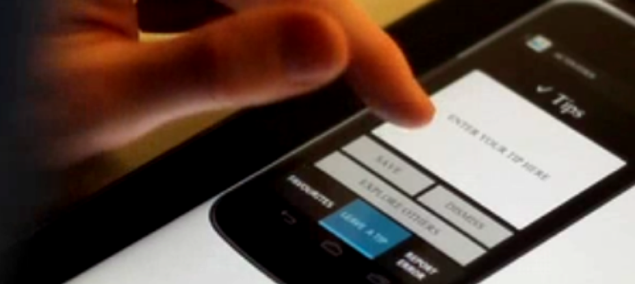
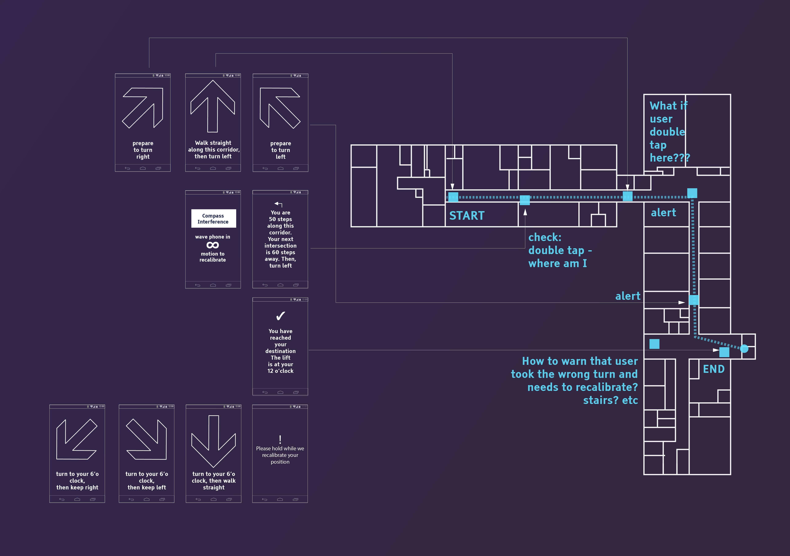
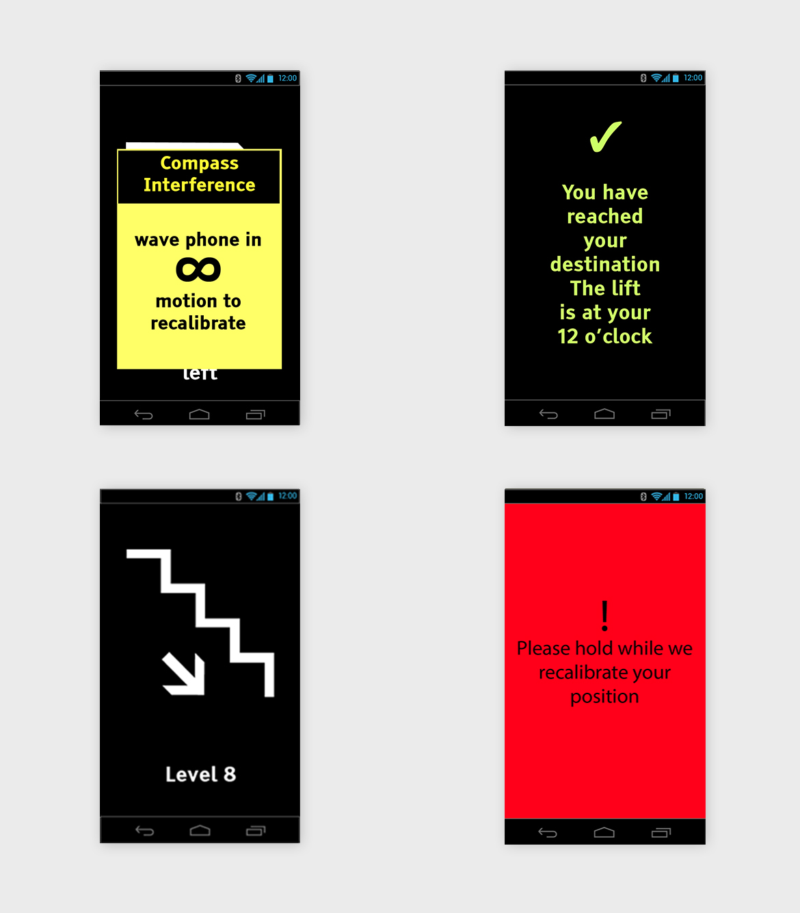

This was an Australian Research Council linkage project undertaken at the University of New South Wales School of Geomatic Engineering and Computer Science. I teamed up with a group of researchers to explore the development of a Mobility and Location Information System for the Blind and Visually Impaired (BVI).

---

## Technical background

{/* TODO: Update video */}

The internal perception of surroundings by a person with limited or no sight is remarkably different to our own. How do we design an interface which delivers information to this particular group of users in the most accessible and meaningful way?

---

## Outcomes

