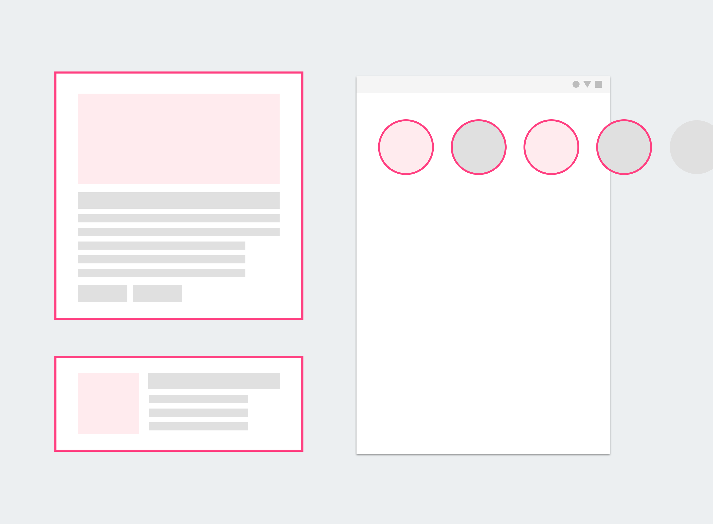
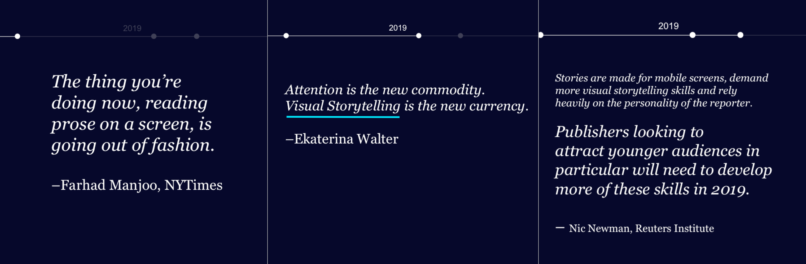
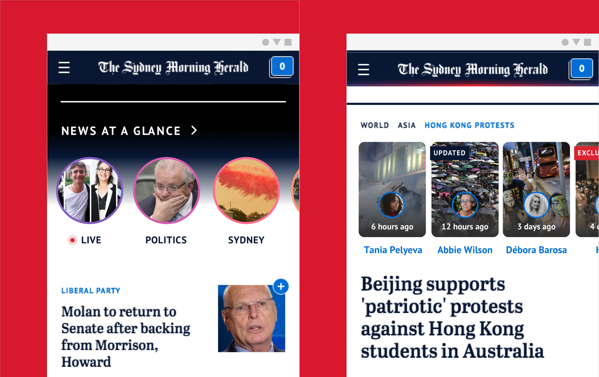
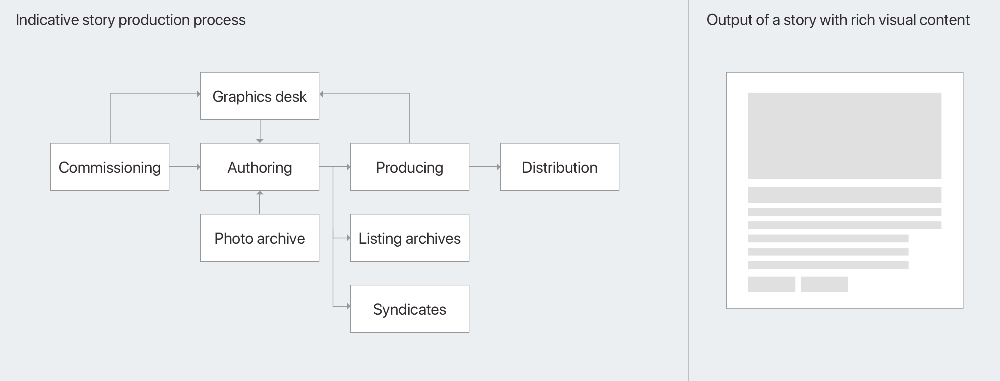
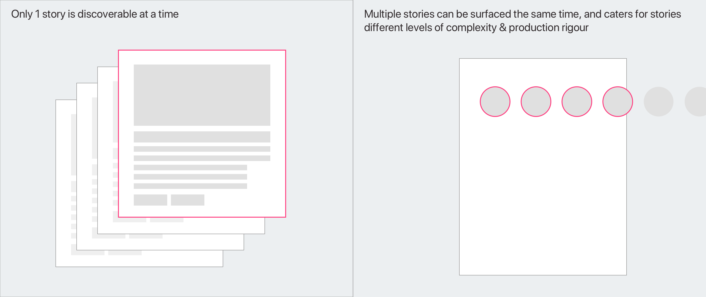
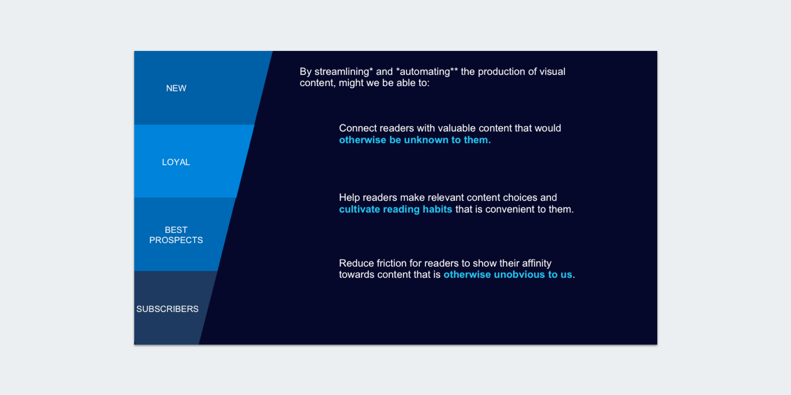

## A Proof of concept

A proof of concept to enable discovering and surfacing news visually, without intervening with complex newsroom workflows.

Earlier this year, I lead a team of 4 to explore the possibility of providing our readers an visually rich reading experience by leveraging the wealth of photos, artefacts and content that we produce everyday.

---

## Value proposition and opportunity analysis

This was our opening slide and value proposition for pursuing this topic, illustrating the urgency and importance of visual storytelling.

While the newsroom does have a graphic desk that constantly pumps out interactives, infographics and bespoke 'graphic' content, it is by no means a trivial task by those planning for it and also those who are responsible for producing it. Whether the effort eventually converts meaningful audiences is besides the point, by all means, it serves maybe one piece of news at a time, and would last 24 hours or up to a week at most.

I was inspired by the social desk editors who were really taking full advantage of highly visual social media platforms, live feeds, instagram stories to highlight our photojournalist and cartoonists work, combined with stories and headlines of the day, really showcases our mastheads strengths and persona. It doesn’t require deep graphic knowledge and skills like the graphic desks do. It does require some editing skills and a good news sense, which most journalists would have anyway, but the heavy lifting on presentation and consumption format are all taken care by the social media platforms that they work on. And based on our metrics, a well crafted visual story could so much more effective at getting the point across in less effort and shorter amount.

It did lead us to speculate what makes the former work and how we might leverage this experience to continue building brand loyalty and showing the strength of our journalism.

---

## Visualisation and prototyping

Left (News at a Glance): A visualisation of how daily stories can be presented in a more condensed format, users can swipe through each chip to get a sense of what's happening on that day and enhances their ability to discover stories that might otherwise be hidden once they leave the homepage.

Right (Related tags): Stories that are related to a topic are presented as tiles right underneath the tag in prioritised or chronological format. It helps present how a particular story unfold over time, or simply act as a mechanism to allow users to drill deeper into the topic with richer visual representations.

---

## Reimagining the process

Our syndicate stories and photojournalists together contributes a significant amount of visual materials to use but there are simply limited resources to 'produce' them into actual articles. What if there were better ways to showcase these visual materials and allow readers to simply browse through a visual library of what's happening each day?

---

## Workflow and audience impact

Currently, the way to commission a piece of interactive story is to go through the normal channel writing the story, commissioning graphics desk resources, producing and editing. Not only is it time consuming and can only be done one piece at a time. The goal of this process is to highlight the content of a particular story, and making sure people are spending time on that article.

---

## Articulation and Presentation

But visual stories can do more than just that. The format as shown below, is automated and requires much less 'production' effort. Although it is less detailed than the former but it is brief and dense and it allows people to consume information in a way that is more similar to 'browsing' than reading in depth. It allows a reader to read wider coverage in a short amount of time and allowing more stories to gain airtime that would otherwise get buried over time.

---

## Solution design and live demo

With that in mind, we set our goal to implement a solution that ingests what's already in the CMS and leverage an open source react library called react-insta-stories to help us with the rendering and displaying of content. This makes sure that we honour what has already been approved and published on the site, and only testing whether augmenting the reading experience can create the impact intended.

---

## Summary and credits

In the end, we took home the highest honour of the competition — people's choice award amongst a dozen other teams. All in all it wasn't the most technically groundbreaking solution, but we focused on showing sound product rationale behind the hack, and focussed on telling a good story and what value it adds to the business. Most importantly, it was the team's dedication to the cause and respectfulness towards each other that really got us to the finishing line.
